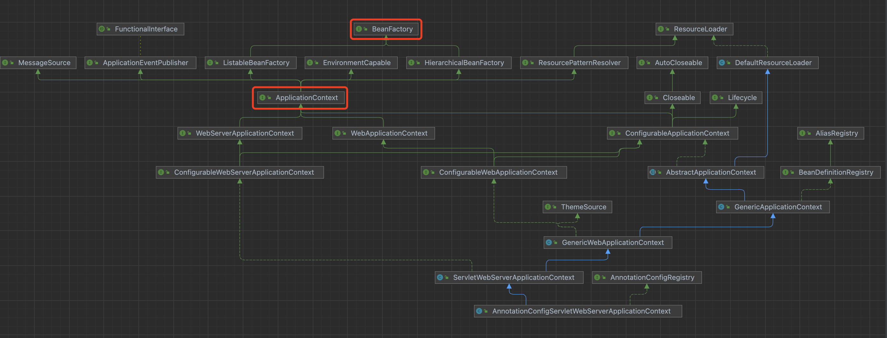

# SpringBoot 是如何实现IoC的

> IoC控制反转，是面向对象编程中的一种设计原则。DI依赖注入，在对象被创建的时候，将其所依赖的对象传递给它，DI是IoC的一种实现

1. 使用

在SpringBoot中依赖注入的使用非常简单，如下代码所示： 我们通过 **@Autowired** 注解就将 **TestService** 注入到了 **MainService** 中

```
@Service
public class MainService {
    @Autowired
    private TestService testService;

    public void mainTest() {
        System.out.println("mainTest");
        testService.test();
    }
}

@Service
public class TestService {
    public void test() {
        System.out.println("testService.test()");
    }
}
```

2. 实现

- Bean的注册

    从 [上一章](https://github.com/Zjalon/OneObject/tree/main/start) 中，我们知道SpringBoot在启动的run方法中调用 createApplicationContext()
    方法，创建了应用上下文
    
    ```
        ApplicationContextFactory DEFAULT = (webApplicationType) -> {
            try {
                switch (webApplicationType) {
                case SERVLET:
                    return new AnnotationConfigServletWebServerApplicationContext();
                case REACTIVE:
                    return new AnnotationConfigReactiveWebServerApplicationContext();
                default:
                    return new AnnotationConfigApplicationContext();
                }
            }
            catch (Exception ex) {
                throw new IllegalStateException("Unable create a default ApplicationContext instance, "
                        + "you may need a custom ApplicationContextFactory", ex);
            }
        };
    ```
    
    通过debug我们可以看到，这个方法根据 **webApplicationType** 返回了一个 **AnnotationConfigServletWebServerApplicationContext** 实例
    
    我们看一下它的类图
    
    
    **BeanFactory** bean工厂类是Spring框架最核心的接口，它提供了IoC的配置机制
    
    **ApplicationContext** 应用上下文是建立在BeanFactory基础上，又提供了更多面向应用的功能
    
    而在SpringBoot中使用的是 **ApplicationContext** 的子类 **AnnotationConfigServletWebServerApplicationContext**
    
    在创建了应用上下文后，调用 **refreshContext()** 方法，在这个方法中调用了应用上下文本身的 **refresh()** 方法，主要在抽象类 **AbstractApplicationContext** 中实现
    
    ```
        @Override
        public void refresh() throws BeansException, IllegalStateException {
            synchronized (this.startupShutdownMonitor) {
                StartupStep contextRefresh = this.applicationStartup.start("spring.context.refresh");
                // Prepare this context for refreshing.
                prepareRefresh();
                // Tell the subclass to refresh the internal bean factory.
                ConfigurableListableBeanFactory beanFactory = obtainFreshBeanFactory();
                // Prepare the bean factory for use in this context.
                prepareBeanFactory(beanFactory);
                try {
                    // Allows post-processing of the bean factory in context subclasses.
                    postProcessBeanFactory(beanFactory);
                    StartupStep beanPostProcess = this.applicationStartup.start("spring.context.beans.post-process");
                    // Invoke factory processors registered as beans in the context.
                    invokeBeanFactoryPostProcessors(beanFactory);
                    // Register bean processors that intercept bean creation.
                    registerBeanPostProcessors(beanFactory);
                    beanPostProcess.end();
                    // Initialize message source for this context.
                    initMessageSource();
                    // Initialize event multicaster for this context.
                    initApplicationEventMulticaster();
                    // Initialize other special beans in specific context subclasses.
                    onRefresh();
                    // Check for listener beans and register them.
                    registerListeners();
                    // Instantiate all remaining (non-lazy-init) singletons.
                    finishBeanFactoryInitialization(beanFactory);
                    // Last step: publish corresponding event.
                    finishRefresh();
                }
                ......
            }
        }
    ```
    
    我们首先看 **invokeBeanFactoryPostProcessors(beanFactory);** 这个方法，在这个方法中会扫描所有Bean文件并解析成Bean，调用方式如下
    
    ```
        protected void invokeBeanFactoryPostProcessors(ConfigurableListableBeanFactory beanFactory) {
            PostProcessorRegistrationDelegate.invokeBeanFactoryPostProcessors(beanFactory, getBeanFactoryPostProcessors());
            ......
        }
        
        public static void invokeBeanFactoryPostProcessors(ConfigurableListableBeanFactory beanFactory, List<BeanFactoryPostProcessor> beanFactoryPostProcessors) {
            ......
            invokeBeanDefinitionRegistryPostProcessors(currentRegistryProcessors, registry, beanFactory.getApplicationStartup());
            ......
        }
        
        private static void invokeBeanDefinitionRegistryPostProcessors(Collection<? extends BeanDefinitionRegistryPostProcessor> postProcessors, BeanDefinitionRegistry registry, ApplicationStartup applicationStartup) {
            ......
            postProcessor.postProcessBeanDefinitionRegistry(registry);
            ......
        }
        
        @Override
        public void postProcessBeanDefinitionRegistry(BeanDefinitionRegistry registry) {
            ......
            processConfigBeanDefinitions(registry);
            ......
        }
        
        public void processConfigBeanDefinitions(BeanDefinitionRegistry registry) {
            ......
            parser.parse(candidates);
            ......
        }
    ```
    
    在 **parser.parse(candidates);** 方法中参数 **candidates** 为我们的启动类，在方法中判断这个类是否是用注解定义的Bean。
    
    而 **@SpringBootApplication** **@Service** 等等我们常用的注解都是被 **@Component** 注解修饰了的
    
    ```
        public void parse(Set<BeanDefinitionHolder> configCandidates) {
            ......
            try {
                if (bd instanceof AnnotatedBeanDefinition) {
                    parse(((AnnotatedBeanDefinition) bd).getMetadata(), holder.getBeanName());
                }
            }
            ......
        }
        
        protected final void parse(AnnotationMetadata metadata, String beanName) throws IOException {
            processConfigurationClass(new ConfigurationClass(metadata, beanName), DEFAULT_EXCLUSION_FILTER);
        }
        
        protected void processConfigurationClass(ConfigurationClass configClass, Predicate<String> filter) throws IOException {
            ......
            // Recursively process the configuration class and its superclass hierarchy.
            SourceClass sourceClass = asSourceClass(configClass, filter);
            do {
                sourceClass = doProcessConfigurationClass(configClass, sourceClass, filter);
            }
            while (sourceClass != null);
            ......
        }
    ```
    
    在这里取了 **@ComponentScans** **@ComponentScan** 这两个注解，也就是我们会在启动类上指定Spring应该去哪里扫描包
    
    ```
        @Nullable
        protected final SourceClass doProcessConfigurationClass(ConfigurationClass configClass, SourceClass sourceClass, Predicate<String> filter) throws IOException {
            // Process any @ComponentScan annotations
            Set<AnnotationAttributes> componentScans = AnnotationConfigUtils.attributesForRepeatable(sourceClass.getMetadata(), ComponentScans.class, ComponentScan.class);
            if (!componentScans.isEmpty() && !this.conditionEvaluator.shouldSkip(sourceClass.getMetadata(), ConfigurationPhase.REGISTER_BEAN)) {
                for (AnnotationAttributes componentScan : componentScans) {
                    // The config class is annotated with @ComponentScan -> perform the scan immediately
                    Set<BeanDefinitionHolder> scannedBeanDefinitions = this.componentScanParser.parse(componentScan, sourceClass.getMetadata().getClassName());
                    // Check the set of scanned definitions for any further config classes and parse recursively if needed
                    for (BeanDefinitionHolder holder : scannedBeanDefinitions) {
                        BeanDefinition bdCand = holder.getBeanDefinition().getOriginatingBeanDefinition();
                        if (bdCand == null) {
                            bdCand = holder.getBeanDefinition();
                        }
                        if (ConfigurationClassUtils.checkConfigurationClassCandidate(bdCand, this.metadataReaderFactory)) {
                            parse(bdCand.getBeanClassName(), holder.getBeanName());
                        }
                    }
                }
            }
        }
    ```
    
    在方法 **this.componentScanParser.parse(componentScan, sourceClass.getMetadata().getClassName());** 中可以看到它是如何解析的
    
    我们什么都不配置的时候，Spring会默认扫描启动类所在包及其下所有子包,它是如何实现的呢
    
    注解 **@SpringBootApplication** 是被 **@ComponentScan** 修饰的，当我们启动类注解 **@SpringBootApplication** 不定义 **@ComponentScan** 时
    会将启动类所在包放到basePackages中
    
    ```
        if (basePackages.isEmpty()) {
            basePackages.add(ClassUtils.getPackageName(declaringClass));
        }
    ```
    
    在最后 return scanner.doScan(StringUtils.toStringArray(basePackages));时会迭代basePackages，通过扫描class获取所有相应的 BeanDefinition
    
    这时就会扫描到我们项目目录下，service文件夹中的两个service的 BeanDefinition
    
    然后循环处理每个 BeanDefinition 最后调用方法 registerBeanDefinition(definitionHolder, this.registry);
    
    ```
        protected Set<BeanDefinitionHolder> doScan(String... basePackages) {
            Assert.notEmpty(basePackages, "At least one base package must be specified");
            Set<BeanDefinitionHolder> beanDefinitions = new LinkedHashSet<>();
            for (String basePackage : basePackages) {
                Set<BeanDefinition> candidates = findCandidateComponents(basePackage);
                for (BeanDefinition candidate : candidates) {
                    ScopeMetadata scopeMetadata = this.scopeMetadataResolver.resolveScopeMetadata(candidate);
                    candidate.setScope(scopeMetadata.getScopeName());
                    String beanName = this.beanNameGenerator.generateBeanName(candidate, this.registry);
                    if (candidate instanceof AbstractBeanDefinition) {
                        postProcessBeanDefinition((AbstractBeanDefinition) candidate, beanName);
                    }
                    if (candidate instanceof AnnotatedBeanDefinition) {
                        AnnotationConfigUtils.processCommonDefinitionAnnotations((AnnotatedBeanDefinition) candidate);
                    }
                    if (checkCandidate(beanName, candidate)) {
                        BeanDefinitionHolder definitionHolder = new BeanDefinitionHolder(candidate, beanName);
                        definitionHolder =
                                AnnotationConfigUtils.applyScopedProxyMode(scopeMetadata, definitionHolder, this.registry);
                        beanDefinitions.add(definitionHolder);
                        registerBeanDefinition(definitionHolder, this.registry);
                    }
                }
            }
            return beanDefinitions;
        }
    ```
    
    在 DefaultListableBeanFactory 的 registerBeanDefinition(String beanName, BeanDefinition beanDefinition) 方法中
    会在this.beanDefinitionMap通过beanName取出beanDefinition，如果没有将beanDefinition放入beanDefinitionMap中
    
    到这里Spring注册Bean的流程就基本结束了
- Bean的初始化

  调用 **invokeBeanFactoryPostProcessors(beanFactory);** 注册Bean结束后
  继续执行 **finishBeanFactoryInitialization(beanFactory);** 方法，这个方法就是初始化Bean，并构建Bean依赖关系的方法，调用顺序如下
  ```
      protected void finishBeanFactoryInitialization(ConfigurableListableBeanFactory beanFactory) { {
        ......
        // Instantiate all remaining (non-lazy-init) singletons.
        beanFactory.preInstantiateSingletons();
        ......
      }
  ```
  ```
     public void preInstantiateSingletons() throws BeansException {
        if (logger.isTraceEnabled()) {
            logger.trace("Pre-instantiating singletons in " + this);
        }

        // Iterate over a copy to allow for init methods which in turn register new bean definitions.
        // While this may not be part of the regular factory bootstrap, it does otherwise work fine.
        List<String> beanNames = new ArrayList<>(this.beanDefinitionNames);

        // Trigger initialization of all non-lazy singleton beans...
        for (String beanName : beanNames) {
            RootBeanDefinition bd = getMergedLocalBeanDefinition(beanName);
            // 实例化所有的单例的、非懒加载的、非抽象的bean
            if (!bd.isAbstract() && bd.isSingleton() && !bd.isLazyInit()) {
                // 判断是否是工厂bean
                if (isFactoryBean(beanName)) {
                    Object bean = getBean(FACTORY_BEAN_PREFIX + beanName);
                    if (bean instanceof FactoryBean) {
                        FactoryBean<?> factory = (FactoryBean<?>) bean;
                        boolean isEagerInit;
                        if (System.getSecurityManager() != null && factory instanceof SmartFactoryBean) {
                            isEagerInit = AccessController.doPrivileged((PrivilegedAction<Boolean>) ((SmartFactoryBean<?>) factory)::isEagerInit,getAccessControlContext());
                        }
                        else {
                            isEagerInit = (factory instanceof SmartFactoryBean && ((SmartFactoryBean<?>) factory).isEagerInit());
                        }
                        if (isEagerInit) {
                            getBean(beanName);
                        }
                    }
                }
                else {
                    getBean(beanName);
                }
            }
        }
        ......
    }
  ```
  主要是 **getBean(beanName);** 方法，最终会调用 **doGetBean** 方法
  ```
      protected <T> T doGetBean(String name, @Nullable Class<T> requiredType, @Nullable Object[] args, boolean typeCheckOnly) throws BeansException {
        ......
        // Create bean instance.
            if (mbd.isSingleton()) {
                sharedInstance = getSingleton(beanName, () -> {
                try {
                    return createBean(beanName, mbd, args);
                }catch (BeansException ex) {
                    // Explicitly remove instance from singleton cache: It might have been put there
                    // eagerly by the creation process, to allow for circular reference resolution.
                    // Also remove any beans that received a temporary reference to the bean.
                    destroySingleton(beanName);
                    throw ex;
                }
                });
                beanInstance = getObjectForBeanInstance(sharedInstance, name, beanName, mbd);
            }
        ......
      }
  ```
  最终会在 **getSingleton;** 方法中实例化bean并进行属性注入
  ```
     public Object getSingleton(String beanName, ObjectFactory<?> singletonFactory) {
        Assert.notNull(beanName, "Bean name must not be null");
        synchronized (this.singletonObjects) {
            Object singletonObject = this.singletonObjects.get(beanName);
            if (singletonObject == null) {
                ......
                // 解决循环依赖问题，使用一个set保存正在实例化的bean
                beforeSingletonCreation(beanName);
                boolean newSingleton = false;
                boolean recordSuppressedExceptions = (this.suppressedExceptions == null);
                if (recordSuppressedExceptions) {
                    this.suppressedExceptions = new LinkedHashSet<>();
                }
                try {
                    // 调用传进来的回调createBean，创建bean
                    singletonObject = singletonFactory.getObject();
                    newSingleton = true;
                }
                ......
            }
            return singletonObject;
        }
    }
  ```
  通过 singletonFactory.getObject(); 调用回调方法，执行 **doGetBean** 中的 **createBean(beanName, mbd, args);**

  ```
     @Override
     protected Object createBean(String beanName, RootBeanDefinition mbd, @Nullable Object[] args) throws BeanCreationException {
        ......
        try {
            // 创建Bean并完成属性注入
            Object beanInstance = doCreateBean(beanName, mbdToUse, args);
            if (logger.isTraceEnabled()) {
                logger.trace("Finished creating instance of bean '" + beanName + "'");
            }
            return beanInstance;
        }
        ......
    } 
  ```
  在 doCreateBean 中完成实例化，并进行属性注入
  ```
	 protected Object doCreateBean(String beanName, RootBeanDefinition mbd, @Nullable Object[] args) throws BeanCreationException {

		// Instantiate the bean.
		BeanWrapper instanceWrapper = null;
		if (mbd.isSingleton()) {
			instanceWrapper = this.factoryBeanInstanceCache.remove(beanName);
		}
		if (instanceWrapper == null) {
			// 创建Bean的包装实例
			instanceWrapper = createBeanInstance(beanName, mbd, args);
		}
		// 通过Bean的包装实例获取到类的实例
		Object bean = instanceWrapper.getWrappedInstance();
		Class<?> beanType = instanceWrapper.getWrappedClass();
		if (beanType != NullBean.class) {
			mbd.resolvedTargetType = beanType;
		}

		......
  
		// Initialize the bean instance.
		Object exposedObject = bean;
		try {
			// 完成属性注入
			populateBean(beanName, mbd, instanceWrapper);
			exposedObject = initializeBean(beanName, exposedObject, mbd);
		}
		......
		return exposedObject;
	}
  
  ```